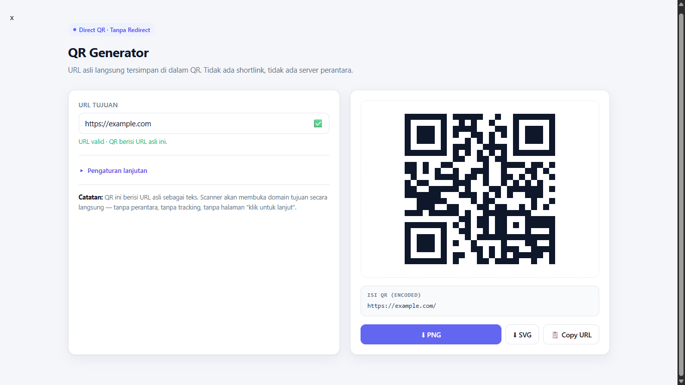

<div align="center">

# 🔳 QR Generator — Direct Link

**QR code generator yang menyimpan URL asli langsung ke dalam QR — bukan shortlink, bukan redirect.**

[](https://opensource.org/licenses/MIT)
[](https://developer.mozilla.org/en-US/docs/Web/JavaScript)
[]()
[]()
[](http://makeapullrequest.com)

[Coba Demo](#-demo) · [Fitur](#-fitur) · [Cara Pakai](#-cara-pakai) · [FAQ](#-faq) · [Lisensi](#-lisensi)

</div>

---

## 📖 Tentang Proyek

**QR Generator — Direct Link** adalah alat berbasis web yang membuat QR code dengan **URL asli langsung di-encode ke dalamnya**. Berbeda dengan kebanyakan QR generator online yang menyimpan shortlink milik mereka (dan mengarahkan ulang ke URL tujuan), alat ini menyimpan URL asli secara permanen.

Artinya:

- ✅ QR berlaku **selamanya** — tidak peduli situs ini masih online atau tidak
- ✅ **Tanpa redirect**, tanpa perantara, tanpa iklan
- ✅ **Tanpa tracking** — tidak ada data yang dikirim ke server mana pun
- ✅ **100% berjalan di browser** — cukup buka `index.html`

---

## ✨ Fitur

### Fitur Inti
| Fitur | Deskripsi |
|---|---|
| 🔗 **Direct URL Encoding** | URL asli langsung tersimpan di dalam QR, bukan shortlink |
| ⚡ **Real-time Preview** | QR berubah seketika saat URL diketik |
| ✅ **Validasi URL** | Deteksi otomatis URL valid/tidak valid secara real-time |
| 📋 **Encoded String Display** | Menampilkan string persis yang tersimpan di QR, jadi bisa diverifikasi |
| 🔒 **100% Client-Side** | Tidak ada request ke server, tidak ada data yang bocor |

### Kustomisasi
| Fitur | Deskripsi |
|---|---|
| 📏 **Ukuran Output** | 256px, 512px, 1024px, 2048px |
| 🛡️ **Error Correction Level** | L (7%), M (15%), Q (25%), H (30%) |
| 📐 **Margin / Quiet Zone** | 0, 2, 4 (disarankan), atau 8 module |
| 🎨 **Warna QR** | Kustom warna foreground (dan background) |
| 🖼️ **Warna Background** | Kustom warna latar belakang QR |

### Export
| Format | Kegunaan |
|---|---|
| **PNG** | Untuk kebutuhan digital (web, sosmed, presentasi) |
| **SVG** | Untuk kebutuhan cetak — tetap tajam di ukuran berapa pun |

---

## 🚀 Demo

Coba langsung tanpa install:

### 👉 **[https://tandurkarsa.github.io/qrcode/](https://tandurkarsa.github.io/qrcode/)**

---

## 🧠 Kenapa Direct, Bukan Redirect?

Sebagian besar QR generator online menggunakan **QR dinamis** yang isinya shortlink milik mereka (`qrco.de/abc`, `bit.ly/xyz`, dll). Saat di-scan, server **mereka** yang mengalihkan ke URL asli.

Akibatnya untuk pengguna:

| Aspek | QR Dinamis (Redirect) | QR Statis (Direct) — Proyek Ini |
|---|---|---|
| **Masa berlaku** | ❌ Mati saat langganan habis | ✅ Selamanya |
| **Limit scan** | ❌ Ada (biasanya 500/bulan untuk free tier) | ✅ Tidak ada |
| **Tracking** | ❌ Data scan dikumpulkan | ✅ Tidak ada |
| **Ketergantungan pihak ketiga** | ❌ Wajib server mereka hidup | ✅ Tidak ada |
| **Biaya** | ❌ $7–$49/bulan untuk fitur penuh | ✅ Gratis |
| **Bisa diedit setelah cetak** | ✅ Bisa | ❌ Tidak bisa (tapi tidak perlu) |
| **Analitik** | ✅ Ada | ❌ Tidak ada (by design) |

**Kesimpulan:** Untuk 90% kasus (URL yang tidak akan berubah seperti landing page, sosmed, menu, kartu nama), **QR direct jauh lebih baik** — gratis, permanen, dan tidak bergantung pada pihak mana pun.

---

## 🛠️ Cara Pakai

### 🌐 Online (Paling Mudah)

1. Buka [demo di atas](#-demo)
2. Ketik URL tujuan (contoh: `example.com/halaman`)
3. QR langsung muncul
4. Klik **PNG** atau **SVG** untuk download

### 💻 Lokal

```bash
# Clone repo
git clone https://github.com/tandurkarsa/qrcode.git
cd qrcode

# Buka index.html di browser
# Cukup double-click, atau pakai live server:
npx serve .
```

Tidak perlu install apa pun. Tidak perlu `npm install`. Tidak perlu build step. Cukup buka `index.html` di browser mana pun.

---

## 📁 Struktur Proyek

```
.
├── index.html      # Aplikasi utama (single-file, HTML + CSS + JS)
├── LICENSE         # MIT License
└── README.md       # Dokumentasi ini
```

Proyek ini sengaja dibuat **single-file** supaya:

- Mudah di-host di mana saja (GitHub Pages, Netlify, Vercel, USB, dll)
- Mudah di-audit — semua kode ada di satu tempat
- Tidak ada dependency build tool

---

## 🧰 Teknologi

| Bagian | Teknologi |
|---|---|
| **Markup & Styling** | HTML5, CSS3 (Custom Properties, Grid, Flexbox) |
| **Logika** | Vanilla JavaScript (ES6+, tanpa framework) |
| **Library QR** | [qr-code-styling](https://github.com/kozakdenys/qr-code-styling) via CDN |
| **Hosting** | GitHub Pages |

**Kenapa vanilla JS?** Karena proyek ini kecil dan fokus. Tidak perlu React/Vue untuk sesuatu yang bisa selesai dalam satu file.

---

## 🔒 Privasi & Keamanan

Proyek ini dirancang dengan prinsip **privacy-first**:

- ❌ **Tidak ada backend** — tidak ada server yang menerima data
- ❌ **Tidak ada analytics** — tidak ada Google Analytics, Plausible, dll
- ❌ **Tidak ada cookies** — tidak ada tracking sama sekali
- ⚠️ **External request minimal** — hanya CDN library saat pertama load
- ✅ **Semua proses di browser** — URL kamu tidak pernah meninggalkan perangkat

Kamu bisa **matikan koneksi internet setelah halaman ter-load**, dan generator tetap berfungsi penuh.

---

## ❓ FAQ

<details>
<summary><b>Apakah QR-nya bisa diedit setelah dicetak?</b></summary>

Tidak. Karena URL asli "dibakar" ke dalam pola piksel QR, mengubahnya berarti generate ulang dan cetak ulang. Ini trade-off dari QR direct — kamu dapat keabadian, tapi kehilangan fleksibilitas edit.

Kalau kamu butuh QR yang bisa diedit setelah cetak, kamu memang butuh QR dinamis (dengan konsekuensi langganan bulanan).
</details>

<details>
<summary><b>Berapa panjang URL maksimal yang bisa di-encode?</b></summary>

Secara teknis, QR code bisa menyimpan hingga **~2.953 byte**. Tapi untuk alasan kepraktisan (mudah di-scan dari jarak jauh), sebaiknya URL di bawah **1.500 karakter**.

Kalau URL kamu terlalu panjang, QR akan sangat padat dan sulit discan, terutama oleh kamera HP lama.
</details>

<details>
<summary><b>Kenapa QR-nya tidak bisa di-scan?</b></summary>

Beberapa kemungkinan:

1. **Ukuran terlalu kecil** — coba download di ukuran lebih besar (1024px atau 2048px)
2. **Kontras kurang** — pastikan warna QR gelap dan background terang
3. **Quiet zone terlalu tipis** — pakai margin minimal 4 module
4. **URL terlalu panjang** — coba error correction level M atau L
5. **Layar terlalu redup** — kalau scan dari layar, naikkan brightness

</details>

<details>
<summary><b>Apakah bisa dipakai untuk WiFi, vCard, atau teks biasa?</b></summary>

Saat ini hanya untuk URL. Format lain (WiFi, vCard, email, SMS) belum didukung di versi ini, tapi ada di [roadmap](#-roadmap).
</details>

<details>
<summary><b>Apakah generator ini menyimpan URL saya?</b></summary>

Tidak. Semua proses terjadi di browser kamu. Tidak ada data yang dikirim ke server. Kamu bisa cek sendiri di tab **Network** di DevTools — tidak ada request keluar selain saat pertama kali load CDN.
</details>

<details>
<summary><b>Boleh dipakai untuk keperluan komersial?</b></summary>

Boleh. Proyek ini di bawah lisensi MIT — bebas dipakai, dimodifikasi, dan didistribusikan, bahkan untuk keperluan komersial. Satu-satunya syarat: sertakan salinan lisensi dan atribusi.
</details>

---

## 🗺️ Roadmap

Fitur yang mungkin ditambahkan di masa depan:

- [ ] **Logo di tengah QR** — dengan error correction level H
- [ ] **Gradient warna** — untuk tampilan lebih menarik
- [ ] **Bentuk module custom** — rounded, dots, classy
- [ ] **Frame & CTA label** — "Scan Me", "Visit Us", dll
- [ ] **Preset tema** — kombinasi warna siap pakai
- [ ] **Batch generate dari CSV** — untuk banyak URL sekaligus
- [ ] **QR mode lain** — WiFi, vCard, email, SMS, WhatsApp
- [ ] **PWA / offline mode** — install sebagai aplikasi
- [ ] **Multi-bahasa** — ID / EN
- [ ] **Riwayat di localStorage** — riwayat QR yang pernah dibuat

Punya ide lain? Buka **Issues** atau kirim **PR**!

---

## 🤝 Kontribusi

Kontribusi dari siapa pun sangat diterima. Untuk kontribusi besar, silakan buka **Issue** dulu untuk diskusi.

### Cara Kontribusi

1. **Fork** repositori ini
2. Buat branch fitur (`git checkout -b fitur/FiturKeren`)
3. Commit perubahan (`git commit -m 'feat: tambah fitur keren'`)
4. Push ke branch (`git push origin fitur/FiturKeren`)
5. Buka **Pull Request**

### Konvensi Commit

Proyek ini mengikuti [Conventional Commits](https://www.conventionalcommits.org/):

- `feat:` — fitur baru
- `fix:` — perbaikan bug
- `docs:` — perubahan dokumentasi
- `style:` — perubahan styling (tanpa mengubah logika)
- `refactor:` — refactor kode
- `chore:` — update dependency, config, dll

---

## 🙏 Acknowledgments

Proyek ini tidak akan ada tanpa:

- [**qr-code-styling**](https://github.com/kozakdenys/qr-code-styling) oleh [@kozakdenys](https://github.com/kozakdenys) — library QR code yang powerful dan fleksibel (MIT License)
- [**GitHub Pages**](https://pages.github.com/) — hosting gratis untuk proyek ini
- [**Shields.io**](https://shields.io/) — untuk badge yang keren

---

## 📄 Lisensi

Proyek ini dirilis di bawah **MIT License** — bebas dipakai untuk keperluan pribadi maupun komersial.

Lihat file [LICENSE](LICENSE) untuk detail lengkap.


---

<div align="center">

**Dibuat dengan ❤️ untuk web yang lebih terbuka.**

Kalau proyek ini bermanfaat, kasih ⭐ di repo ini ya!

[⬆ Kembali ke atas](#-qr-generator--direct-link)

</div>
